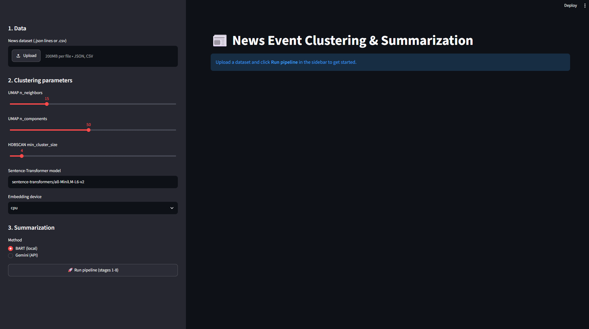
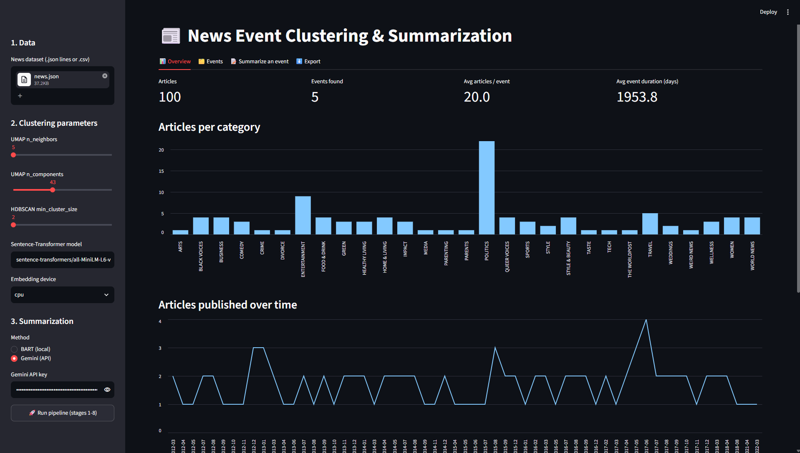
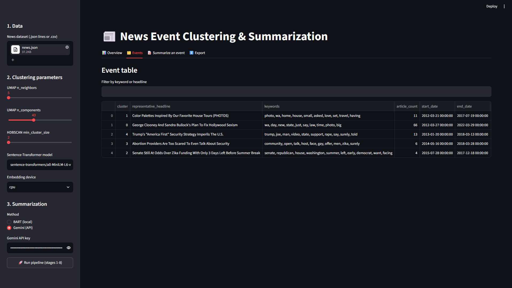
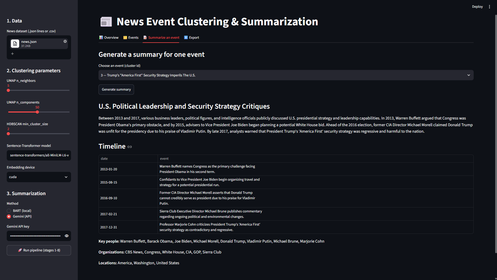
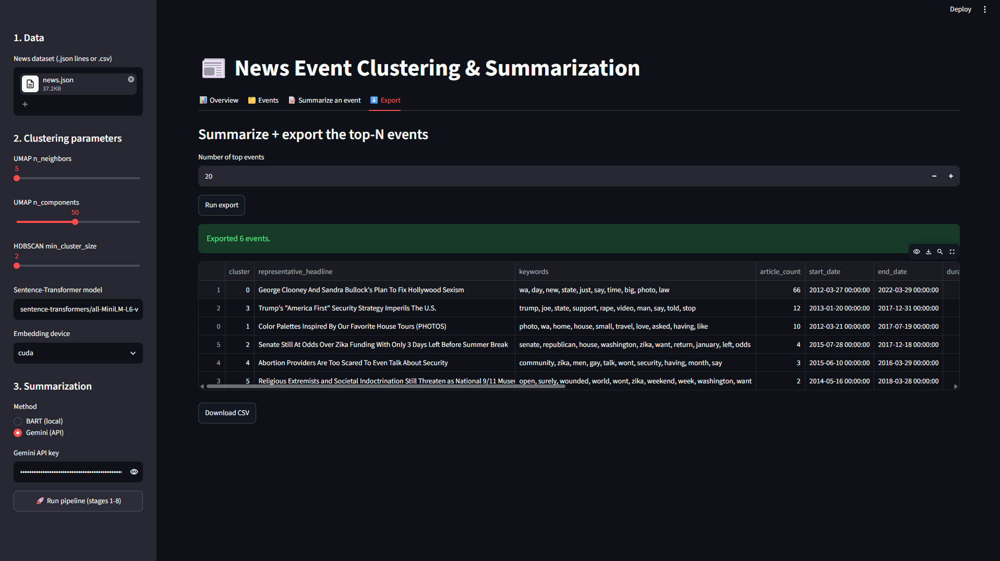

# 📰 AI News Event Clustering & Timeline Builder

In today's world, the same real-world event is reported by hundreds of news articles across different platforms and days, which makes it hard to see the bigger picture. This project solves that by automatically:

- 🧩 **Grouping** news articles into real-world **events**
- 📅 **Building a chronological timeline** for each event
- ✍️ **Generating a short summary** explaining how the event evolved over time

The full pipeline — from raw article data to an interactive dashboard — is wrapped in a **Streamlit app**, so no code needs to be touched to explore results.



---

## ✨ Features

- Upload any news dataset (`.json` lines or `.csv`) with headline/description/date/category fields
- Tunable clustering parameters (UMAP dimensionality reduction + HDBSCAN density clustering) right from the sidebar
- Automatic **TF-IDF keyword extraction** and **representative headline** selection per event/cluster
- On-demand **event summarization** with a choice of:
  - **BART (local)** — free, runs offline, no API key needed
  - **Gemini (API)** — higher-quality summaries, needs a Gemini API key
- Per-event **timeline table** with key people, organizations, and locations extracted
- Overview dashboard with KPIs and charts (articles per category, articles published over time)
- Export the top-N summarized events to CSV

---

## 🗂️ Project Structure

```
AI-News-Event-Clustering-Timeline-Builder/
├── App/
│   ├── config.py               # PipelineConfig — shared settings for every stage
│   ├── data_loader.py          # Stage 1: load dataset (JSON lines / CSV)
│   ├── data_cleaning.py        # Stage 2: nulls, duplicates, dtype fixes
│   ├── feature_engineering.py  # Stage 4: build combined text field
│   ├── embeddings.py           # Stage 5: SentenceTransformer embeddings (cached)
│   ├── clustering.py           # Stage 6: UMAP + HDBSCAN
│   ├── keyword_extraction.py   # Stage 7a: TF-IDF top keywords per cluster
│   ├── event_labeling.py       # Stage 7b: representative headline per cluster
│   ├── event_table.py          # Stage 8: event-level table
│   ├── summarization.py        # Stage 10: BART + Gemini summarization
│   ├── export.py               # Stage 11: summarize + export top-N to CSV
│   ├── pipeline.py             # NewsEventPipeline — wires all stages together
│   └── main.py                 # Streamlit dashboard (entry point)
├── Assets/                     # Screenshots used in this README
├── Data/
│   ├── Final top_100 summery.csv
│   └── dataset_source.txt.txt
├── Docs/
│   └── PROJECT_WORKFLOW.txt    # Full workflow + setup notes + issues hit & fixes
├── Notebook/
│   └── News_Event_Clustering.ipynb   # Original end-to-end research notebook
├── requirements.txt
└── LICENSE
```

---

## ⚙️ How It Works

```
load_data()            Stage 1  → reads the uploaded file
        │
        ▼
clean_data()            Stage 2  → drops nulls/dupes, parses dates
        │
        ▼
feature_engineering()   Stage 4  → text = headline + description
        │
        ▼
generate_embeddings()   Stage 5  → SentenceTransformer embeddings
        │                          (cached by dataset content hash)
        ▼
cluster_events()        Stage 6  → UMAP dimensionality reduction
        │                          → HDBSCAN density clustering
        ▼
extract_keywords()      Stage 7a → TF-IDF top keywords per cluster
        │
        ▼
label_events()           Stage 7b → representative headline per cluster
        │
        ▼
build_event_table()      Stage 8  → one row per event (article count,
                                     keywords, start/end date)
```

Summarization (BART or Gemini) and CSV export run on demand from their own tabs, rather than as part of the automatic pipeline run.

---

## 🚀 Getting Started

### 1. Clone and set up a virtual environment

```bash
git clone https://github.com/ENGABHAY/AI-News-Event-Clustering-Timeline-Builder.git
cd AI-News-Event-Clustering-Timeline-Builder

python -m venv venv
venv\Scripts\activate          # Windows
source venv/bin/activate       # Mac/Linux
```

### 2. Install dependencies

```bash
pip install -r requirements.txt
```

> **Note:** BART is not a separate package — it ships inside `transformers` + `torch` (`BartForConditionalGeneration`, `BartTokenizer`). The model weights (~1.6GB) auto-download from Hugging Face the first time you generate a BART summary, then are cached locally. Gemini summarization needs a Gemini API key, entered in the sidebar at runtime — it's not an installation step.

### 3. Run the app

```bash
cd App
streamlit run main.py
```

This opens the dashboard in your browser at `http://localhost:8501`.

### 4. Use the app

1. **Upload** a dataset (`.json` lines or `.csv`) in the sidebar
2. Adjust **UMAP / HDBSCAN** clustering parameters, or leave the defaults
3. Choose a summarization **method** — BART (local) or Gemini (API key)
4. Click **🚀 Run pipeline (stages 1-8)**

---

## 📊 Screenshots

### Overview
KPIs and charts — articles per category, articles published over time.



### Events
A searchable table of every detected event with its keywords, article count, and date range.



### Summarize an Event
Pick an event and generate an AI summary with a timeline, key people, organizations, and locations.



### Export
Summarize and download the top-N events as a CSV.



---

## 📦 Dataset

This project was built and tested on the **[News Category Dataset (v3)](https://www.kaggle.com/datasets/rmisra/news-category-dataset?select=News_Category_Dataset_v3.json)** from Kaggle. Any dataset with similar fields (headline, short description, category, date) in `.json` lines or `.csv` format will work.

---

## 🛠️ Troubleshooting

| Issue | Fix |
|---|---|
| "0 rows after cleaning" | Inspect the raw file structure; confirm it's real JSON-lines or CSV |
| Embedding/clustering errors | Delete the `cache/` folder and re-run the pipeline |
| BART first run is slow | Normal — it's downloading the ~1.6GB model once |
| Gemini errors | Check the API key and confirm the model name is current |

A detailed log of issues hit during development (unhashable dict columns, malformed dates, empty-embeddings from a misread JSON file, stale embedding cache) and how each was fixed is documented in [`Docs/PROJECT_WORKFLOW.txt`](Docs/PROJECT_WORKFLOW.txt).

---

## 🧰 Tech Stack

`Python` · `Streamlit` · `pandas` / `numpy` · `scikit-learn` · `sentence-transformers` · `UMAP` · `HDBSCAN` · `NLTK` · `Transformers` (BART) · `Google Gemini API`

---

## 📄 License

See [LICENSE](LICENSE) for details.
